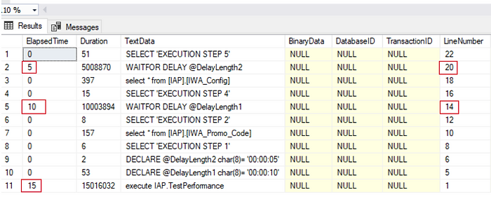

# SQL Server Trace Template - old work revived.

## Project's description

This article details implementing a solution to measure SQL Server stored procedure execution.

## Online article
Details about this project can be read in my blog's article here: 

[Article](https://www.ideliversoft.com/post/sql-server-trace-template-old-work-revived)

## Context
I have done this work in 2010. The main technologies used were: **.NET Framework** and **SQL Server**.

